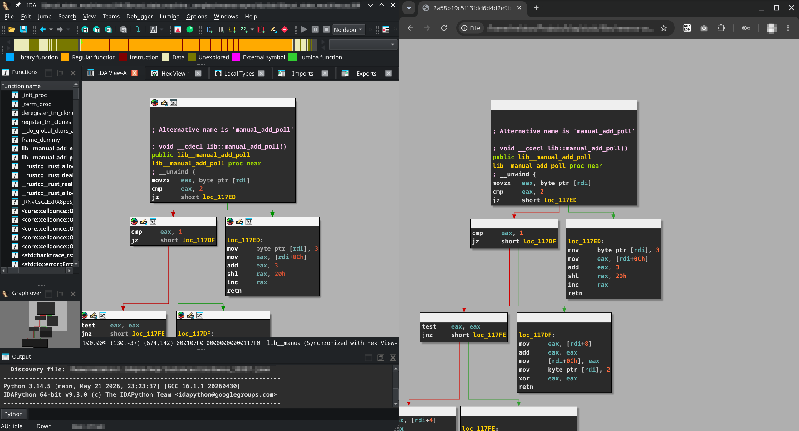

# IDA Graph Exporter

Export an IDA Pro function graph view to a self-contained interactive HTML page.

The IDAPython script retrieves graph layout, basic blocks, disassembly text, token colors, edge routing, and input-file metadata from the currently focused graph view. The generated HTML embeds the graph data directly and renders it with vanilla JavaScript, so it can be opened from disk or hosted as a static file.

This project is derived from the [IDA Graph Exporter](https://github.com/kirschju/ida-graph-exporter) plugin by Julian Kirsch.
The primary differences are: IDAPython versus native plugin, and HTML versus SVG/PDF output.
Note that the original project has broader SVG/PDF export support and more complete theme/font handling.

## Features

- Exports the currently focused IDA graph view from IDAPython.
- Produces a single self-contained HTML file with embedded graph JSON.
- Uses vanilla JavaScript; no build step, package manager, or runtime server is required.
- Preserves IDA graph node positions, sizes, and routed edge points from the active graph view.
- Renders IDA disassembly color tokens for labels, mnemonics, registers, operands, comments, numbers, and names.
- Uses an IDA 9-style dark graph theme with dark basic blocks, light title bars, gray canvas, and colored disassembly text.
- Colors graph edges by branch kind:
  - false/no edges: red
  - true/yes edges: green
  - normal/unconditional edges: blue
- Draws arrowheads on graph edges.
- Supports legacy exports that only contain IDA's encoded edge color values.
- Supports address anchors for clickable disassembly references.
- Automatically shrinks font size and line height when browser text metrics would overflow IDA's exported node boxes.
- Adds initial viewport padding so graphs near coordinate `(0, 0)` are not clipped on first load.
- Supports mouse interaction:
  - drag to pan
  - inertial pan after dragging
  - mouse wheel to scroll vertically
  - `Shift` + mouse wheel to scroll horizontally
  - `Ctrl` + mouse wheel to zoom around the mouse cursor
- Works inside an iframe: wheel and `Ctrl` + wheel interactions are handled by the graph page itself.
- Includes checked-in example output under `example/`.

## How?

Run the script `export_ida_graph.py` from IDA Pro and select the output path for the HTML file.
Then, open this file in a web browser, optionally hosting it on a web server.

The output file is self-contained: the renderer uses vanilla JavaScript and embeds the graph data directly in the HTML.
This means exported documents can be viewed offline, such as inside a malware analysis VM.

## Controls

- Drag: pan the graph.
- Mouse wheel: move up and down.
- `Shift` + mouse wheel: move left and right.
- `Ctrl` + mouse wheel: zoom in and out around the mouse cursor.
- Click an address/name reference: jump to the corresponding location anchor when available.

## Example

Here is the IDA Pro graph view side-by-side with the exported graph rendered by MS Edge:

You can also view the exported graph in your browser [here](http://www.williballenthin.com/tools/ida/mimikatz/0x46e2b7/index.html).

Note that the rendering is not perfect. Here are the things I'm aware of:

  - a bunch of colored items, due to suspected bug in IDAPython:
    - line background colors
    - node background colors
  - the exact IDA font is not exported; the renderer uses a close monospace stack
  - node header icons are not reproduced
